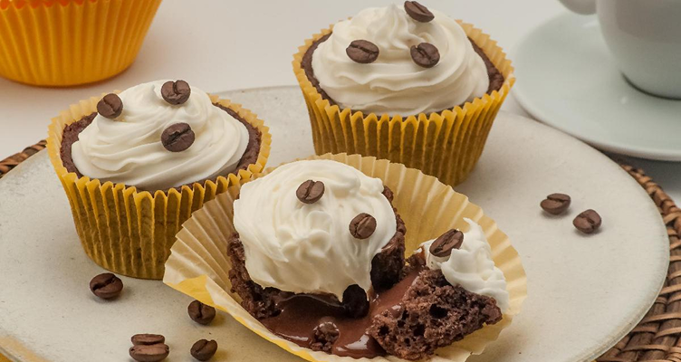

# 🧁 Receita de Cupcake

<p align="center">
  
</p>

## 📝 Sobre o Projeto

Este projeto foi desenvolvido por Jackson Felipe durante os estudos da Rocketseat, como parte do curso Full-Stack. Trata-se de uma página web elegante que apresenta uma receita de cupcake de café com chantilly, com design responsivo e estilização cuidadosa.

## 🚀 Tecnologias Utilizadas

- **HTML5**: Estruturação da página
- **CSS3**: Estilização e layout
- **Fontes Google**: Família de fonte 'Alice'
- **Imagens**: Recursos visuais para melhorar a experiência do usuário

## 🎨 Layout

O layout foi cuidadosamente desenvolvido para proporcionar uma experiência agradável ao usuário, com:

- Fundo texturizado
- Paleta de cores em tons terrosos e amarelados, remetendo ao tema café
- Tipografia elegante e de fácil leitura
- Estrutura clara e organizada da receita

## 📋 Funcionalidades

- Apresentação da receita de cupcake de café com chantilly
- Informações sobre tempo de preparo, rendimento e dificuldade
- Lista detalhada de ingredientes
- Modo de preparo dividido em etapas claras

## 📁 Estrutura do Projeto

```
├── assets/
│   ├── Vector.svg         # Ícone de coração para o footer
│   ├── bg-image.jpg       # Imagem de fundo da página
│   └── main-image.png     # Imagem principal do cupcake
├── css/
│   └── styles.css         # Estilos da aplicação
├── index.html             # Arquivo HTML principal
└── README.md              # Documentação do projeto
```

## 🔍 Detalhes de Implementação

- **Semântica HTML**: Utilização de tags semânticas para melhor acessibilidade
- **CSS Moderno**: Uso de variáveis CSS e seletores avançados
- **Design Responsivo**: Layout adaptável a diferentes tamanhos de tela

## 🖥️ Como Visualizar

1. Clone este repositório:
```bash
git clone https://seu-repositorio/Receita-Cupcake.git
```

2. Abra o arquivo `index.html` em seu navegador preferido

## 🎓 Aprendizados

Este projeto permitiu aplicar conceitos importantes de desenvolvimento web:

- Estruturação semântica com HTML
- Estilização avançada com CSS
- Organização de arquivos em um projeto web
- Boas práticas de design e experiência do usuário

## 👨‍💻 Autor

Desenvolvido por **Jackson Felipe** com 💛 durante os estudos da Rocketseat.

---

